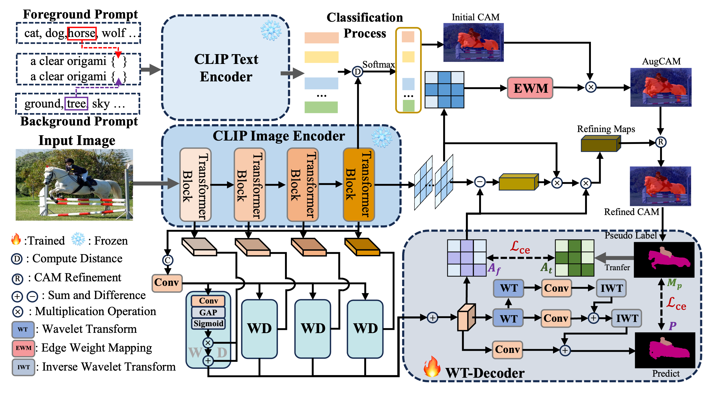
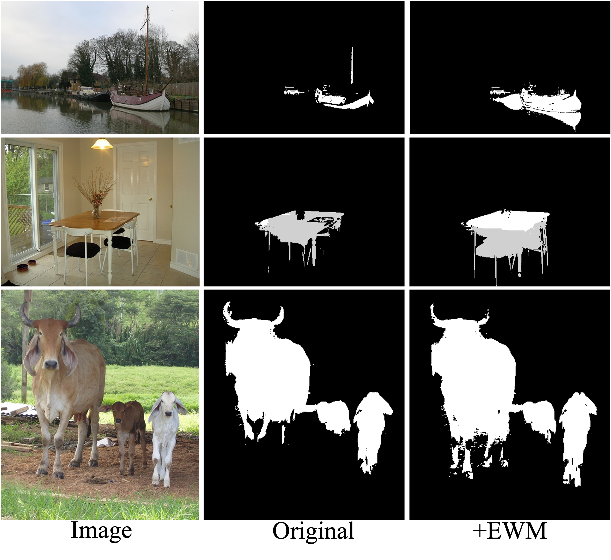

# WTCLIP: A Wavelet-Aware CLIP Framework for Boundary-Refined Weakly Supervised Semantic Segmentation (Submitted to AAAI2026)


# <span style="color: red; font-size: 1.5em;">We sincerely thank all reviewers !</span>


<div align="center">

</div>

<p align="center"><b><font size="70"></font></b></p>


Current some advanced methods have leveraged the zero-shot recognition capability of the contrastive language-image pretraining (CLIP) model and adapted it to weakly supervised semantic segmentation (WSSS), achieving promising performance. However, they primarily use CLIP as an auxiliary feature extractor, leaving the fundamental limitations of class activation mapping (CAM) unresolved, particularly in preserving fine-grained object boundaries and achieving precise pixel-wise localization under sparse supervision. To address these challenges, this paper proposes a novel end-to-end WSSS framework WTCLIP, which aims to fully exploit the potential of CLIP for weakly supervised segmentation tasks. Different from traditional methods that use CLIP only as a static feature extractor, we innovatively introduce a learnable wavelet transform decoder to enhance the information extraction capability and significantly improve the model's perception of object boundaries. The effective suppression of high-frequency information during image downsampling in CLIP can be achieved by capturing multi-scale contextual information and leveraging the time-frequency localization properties of wavelet transforms, thereby significantly improving the quality of pseudo-labels and enabling more accurate semantic segmentation. Experimental results show that our method significantly improves the performance of the WSSS task on two public benchmark datasets, notably by 4.0\% over the state-of-the-art methods, especially in capturing weakly annotated object boundary details.


## Preparations

### VOC dataset

#### 1. Download

``` bash
wget http://host.robots.ox.ac.uk/pascal/VOC/voc2012/VOCtrainval_11-May-2012.tar
tar –xvf VOCtrainval_11-May-2012.tar
```
#### 2. Download the augmented annotations
The augmented annotations are from [dataset](http://home.bharathh.info/pubs/codes/SBD/download.html). Here is a download link of the augmented annotations at
[DropBox](https://www.dropbox.com/s/oeu149j8qtbs1x0/SegmentationClassAug.zip?dl=0). After downloading ` SegmentationClassAug.zip `, you should unzip it and move it to `VOCdevkit/VOC2012`. The directory sctructure should thus be 

``` bash
VOCdevkit/
└── VOC2012
    ├── Annotations
    ├── ImageSets
    ├── JPEGImages
    ├── SegmentationClass
    ├── SegmentationClassAug
    └── SegmentationObject
```

### COCO dataset

#### 1. Download
``` bash
wget http://images.cocodataset.org/zips/train2014.zip
wget http://images.cocodataset.org/zips/val2014.zip
```
After unzipping the downloaded files, for convenience, I recommand to organizing them in VOC style.

``` bash
MSCOCO/
├── JPEGImages
│    ├── train
│    └── val
└── SegmentationClass
     ├── train
     └── val
```

#### 2. Generating VOC style segmentation labels for COCO
To generate VOC style segmentation labels for COCO dataset, you could use the scripts provided at this [repo](https://github.com/alicranck/coco2voc). Or, just downloading the generated masks from [Google Drive](https://drive.google.com/file/d/1pRE9SEYkZKVg0Rgz2pi9tg48j7GlinPV/view).

### Create and activate conda environment

```bash
conda create --name wtclip python=3.10
conda activate wtclip
pip install -r requirments.txt
```


### Download Pre-trained CLIP-VIT/16 Weights

Download the pre-trained CLIP-VIT/16 weights from the official [link](https://openaipublic.azureedge.net/clip/models/5806e77cd80f8b59890b7e101eabd078d9fb84e6937f9e85e4ecb61988df416f/ViT-B-16.pt).

Then, move this model to `pretrained/`.


### Modify the config
Three parameters requires to be modified based on your path:

(1) root_dir: `your/path/VOCdevkit/VOC2012` or `your/path/MSCOCO`

(2) name_list_dir: `your/path/WTCLIP/datasets/voc` or `your/path/WeCLIP/datasets/coco`

(3) clip_pretrain_path: `your/path/WTCLIP/pretrained/ViT-B-16.pt`

For VOC, Modify them in `configs/voc_attn_reg.yaml`.

For COCO, Modify them in `configs/coco_attn_reg.yaml`. 

### Train
To start training, just run the following code.
```bash
# train on voc
python scripts/train_clip_voc.py --config your/path/WTCLIP/configs/voc_attn_reg.yaml
# train on coco
python scripts/train_clip_coco.py --config your/path/WTCLIP/configs/coco_attn_reg.yaml
```

### Inference
To inference, first modify the inference model path `--model_path` in `test_msc_flip_voc` or `test_msc_flip_voc`

Then, run the following code:
```bash
# inference on voc
python test_msc_flip_voc.py --model_path your/inference/model/path/WTCLIP_model_iter_30000.pth
# inference on coco
python test_msc_flip_coco.py --model_path your/inference/model/path/WTCLIP_model_iter_80000.pth
```

<div align="center">

</div>

<p align="center"><b><font size="70"></font></b></p>

 
